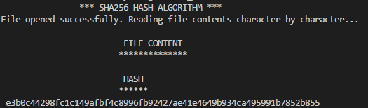
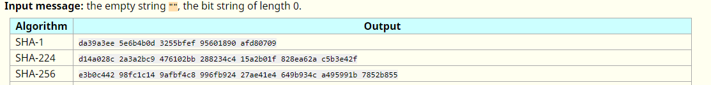
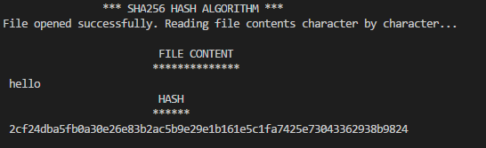
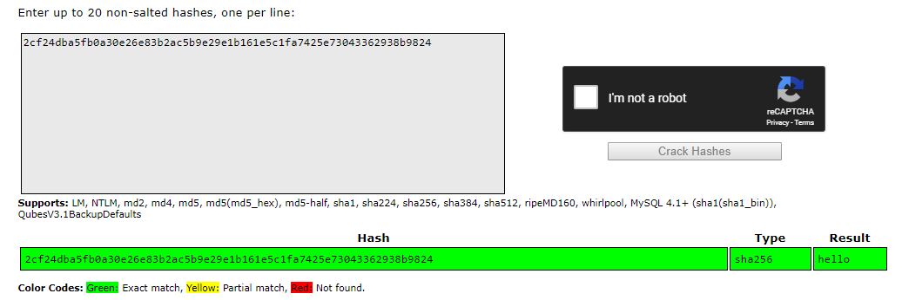
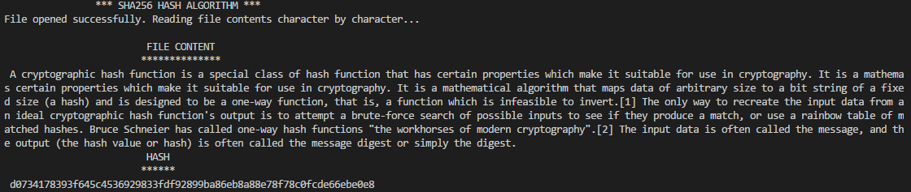
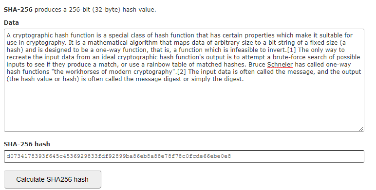

# TheoryOfAlgorithms_SHA256

### Project Description
The goal of this project was to write a program in C language to perform the 256-bit version of Secure Hash Algorithm (SHA) algorithm.  To complete this project, I have read the Secure Hash Standard and I have followed its guidelines which are available under this [link](https://nvlpubs.nist.gov/nistpubs/FIPS/NIST.FIPS.180-4.pdf). Also, I watched the additional tutorials to help me understand how SHA256 algorithm works. Program was developed using google cloud virtual machine, however, I tested and debug it in visual studio code. To test the algorithm, it was necessary to create a text file. First tested file contained empty string then random strings such as "hello" or "abc". To covert plain text to sha256 hash I used online Generator such as: [SHA256 Hash Generator](https://passwordsgenerator.net/sha256-hash-generator) and [crack station](https://crackstation.net).

**This repo contains files:**
* roots.c:  Program which calculates fractional cube roots of primes. 
*	bits.c:  Program that contains Bitwise Operators used in Secure Hash Standard.
*	padfile.c: Program Calculates message padding. 
*	sha256 folder: Contains files which are responsible for calculating the hash values.
*	project.pdf: Includes project requirements.

### Setup/Install
**Step 1. Install compiler for your operating system.**</br>
Windows - [MinGW](http://www.mingw.org/)</br>
**Step 2. Clone Repo**</br>
```https://github.com/kamilam1987/TheoryOfAlgorithms_SHA256.git ``` </br>
**Step 3. Compile the code** </br>
```gcc main.c SHA_256.c -o main ```</br>
**Step 4. Run the code**<br>
```./main <filename> ```</br>

### Project Diary:

**30.01.2019** The first step regarding the project was to read the document under the title "SECURE HASH STANDARD" which is available under the [link](https://nvlpubs.nist.gov/nistpubs/FIPS/NIST.FIPS.180-4.pdf). Then I decided to watch additional videos that helped me to understand more exactly what is SHA_256 [2], [3].

**09.02.2019**  With the help of a video prepared by the lecturer, I was able to write a program that calculated 64 constants from SHA standards. First, I had to declare the first 64 primes numbers. Then, calculate the cube root of a prime numbers and  fractional part of a cube with 64 prime numbers. Next find the first 32 bits of decimal place of the number. Last part was to print this number in hexadecimal.[4]

**14.02.2019** Developed a program called “bit” which contains a bit operator that are used in secure hash algorithm[5]. Follow this link to find out more information’s about bitwise operators in c [6].

**28.02.2019** Following the video[7] that was recorded by our lecturer, I was able to develop the first part of the sha256 algorithm. Program  includes five functions. First which is sha256 calculates the sha256 bit algorithm but currently doesn’t return anything. Sig0 and sig1 functions are defined in hash standard which takes a single 32-bit integer as input and returns 32-bit integer as output. Functions rotr and shr takes two 32-bit integer arguments and returns 32-bit integer (n – amount of rotations).  Definitions for those function can be found under section 3.2 and 4.1.2 in Secure Hash Standards. 

**02.03.2019** Declared K which contains sixty-four constants 32-bit words. Those words represent the first thirty-two bits of the fractional parts of the cube roots of the first sixty-four primes numbers.  All elements of M were initialized to 0. Next step will be to calculate a message block. 

**08.03.2019** The next step was to create a program for preprocessing. It is described in the fifth section of the Secure Hash Standard and is divided into three parts. The first is padding the message which says that the message must be a multiple of 512 bits in length. This function is implemented in my “padfile” program[8] which also opens and read files. Padding can be inserted before the beginning of the process. It can contain the padding. 

**16.03.2019** This week I continued on padding message. Message is multiple of 512 bits in length. Chops the message up into 512 bits blocks and deal with each block in turn, as goes through the message. Generating new hash values as going through and once deals with the last message block, whatever the hash value is at that point this is the final hash value. Also converted big endian to little endian[9] for both 32- and 64-bit words.

**28.03** This week in sha256 file I created union "msgblock" that represents a message block. Added enum status which is a flag for reading a file. Next step was to add function call next message which reads a file, reads the next chunk into message block, keeps a track of number of bits that is read from a file and checks the status.

**29.03** I implemented 64bit and 32bit byte swapping. Then I tested my program with empty sting which was giving correct hash value. Problem was with reading any other text from the file. After additional research it turned out that the important thing is checking if message is big endian and swap it if it’s not.  Last step was to append the file size in bits as an unsigned 64-bit int (big-endian).

**30,31.03** I split sha256 program into multiple files as common practice and continued on README. Today was the last phase of wrapping up the project

### Project Testing
**Test I** on empty sting and checked hash output with [Test vectors](https://www.di-mgt.com.au/sha_testvectors.html) </br>
<p align="center">
  </br>
  
</p>

**Test II** on "hello" sting and checked hash output with [Crack station](https://crackstation.net/) </br>
<p align="center">
  </br>
  
</p>

**Test III** on random text from Wikipedia and checked hash output with [xorbin](https://www.xorbin.com/tools/sha256-hash-calculator)</br> 
<p align="center">
 </br>
  
</p>


### Secure Hash Standard
This standard specifies hash algorithms that can be used to generate digests of messages. They are used to detect if the messages changed. A message digest [10] is a cryptographic hash function containing a string of digits created by a one-way hashing formula. They are designed to protect the integrity of a piece of data or media to detect changes and alterations to any part of a message.  For example, in the image below [11], the right-hand column depicts the message digest for each input:
<p align="center">
    
</p>

This Standard specifies secure hash algorithms - SHA-1, SHA-224, SHA-256, SHA-384, SHA-512, SHA-512/224 and SHA-512/256 - for computing a condensed representation of electronic data (message). However, in this project I’ll focus only on SHA-256.

### About SHA-256
**What is SHA-256?**
SHA-256 [12] is a message-digest algorithm. It's used to compute a hash value in cryptography. Hash function takes a block of data and returns a fixed-size bit string (hash value). The data used by hash functions is referred to as a "message", while the computed hash value is referred to as the "message digest".

**When to use SHA-256?**
SHA-256, like other hash functions, is used in digital signatures, message authentication codes, to index data in hash tables, for finger-printing, to detect duplicate data, uniquely identify files, and as checksums to detect accidental data corruption.

**How big is a SHA-256 hash value?**
SHA-256 produces a 256-bit (32 bytes) hash value. It's usually represented as a hexadecimal number of 64 digits.

**How to decrypt SHA-256?**
You can't! SHA-256 is NOT an encryption algorithm! A lot of people are under the impression that SHA-256 encrypts data. It does no such thing. All it does is compute a hash value for a given set of data.

**How to reverse SHA-256?**
You can't! SHA-256 is NOT reversible. Hash functions are used as one-way methods. They take the data (messages) and compute hash values (digests). The inverse can't be done.

To better explain why a SHA-256 is NOT reversible, here's very simple example:

Using SHA-256 on text data of 750,000 characters, we obtain a mere 64 digits digest. Now if I wanted to revert this, how could I possibly determine with exactitude which 750,000 characters were used from just 64 digits?!? This would be the BEST compression algorithm in the world :P

### References:
[1] https://nvlpubs.nist.gov/nistpubs/FIPS/NIST.FIPS.180-4.pdf</br>
[2] https://www.youtube.com/watch?v=S5wI1s4Kaf4</br>
[3] https://www.youtube.com/watch?v=mbekM2ErHfM<br>
[4] https://web.microsoftstream.com/video/e5e7f5d8-3d2f-4115-9eaa-d9b1d6a91c4e</br>
[5] https://web.microsoftstream.com/video/c24ff5f4-e5e1-4747-af8d-c2c4892856e3?referrer=https:%2F%2Flearnonline.gmit.ie%2Fcourse%2Fview.php%3Fid%3D138 </br>
[6] https://www.geeksforgeeks.org/bitwise-operators-in-c-cpp/</br>
[7] https://web.microsoftstream.com/video/db7c03be-5902-4575-9629-34d176ff1366</br>
[8] https://web.microsoftstream.com/video/9daaf80b-9c4c-4fdc-9ef6-159e0e4ccc13</br>
[9] https://stackoverflow.com/questions/2182002/convert-big-endian-to-little-endian-in-c-without-using-provided-func</br>
[10] https://www.techopedia.com/definition/4024/message-digest</br>
[11] https://en.wikipedia.org/wiki/Cryptographic_hash_function</br>
[12] https://www.freeformatter.com/sha256-generator.html

### Testing:
https://www.di-mgt.com.au/sha_testvectors.html</br>
https://crackstation.net</br>
https://www.xorbin.com/tools/sha256-hash-calculator</br>


